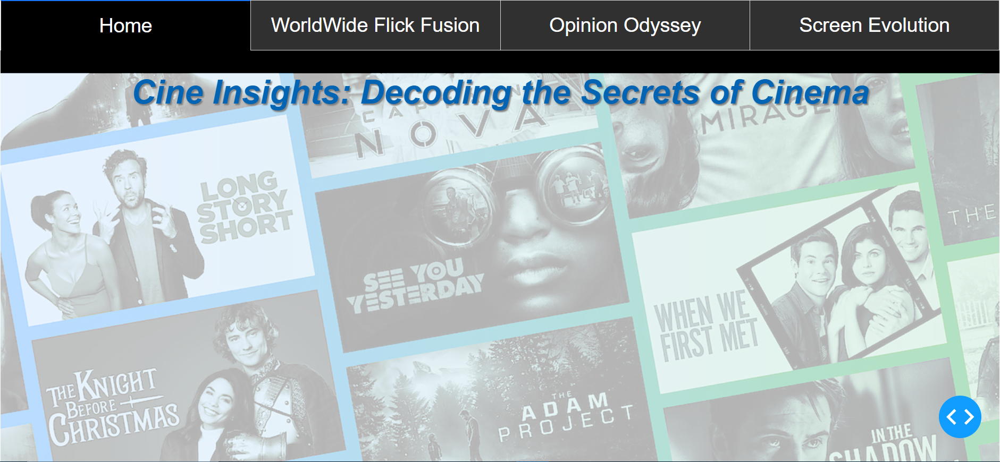
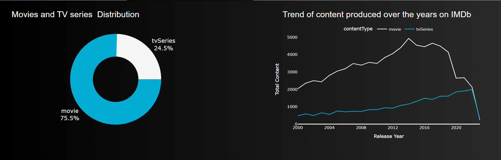
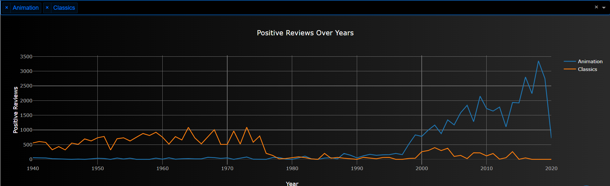
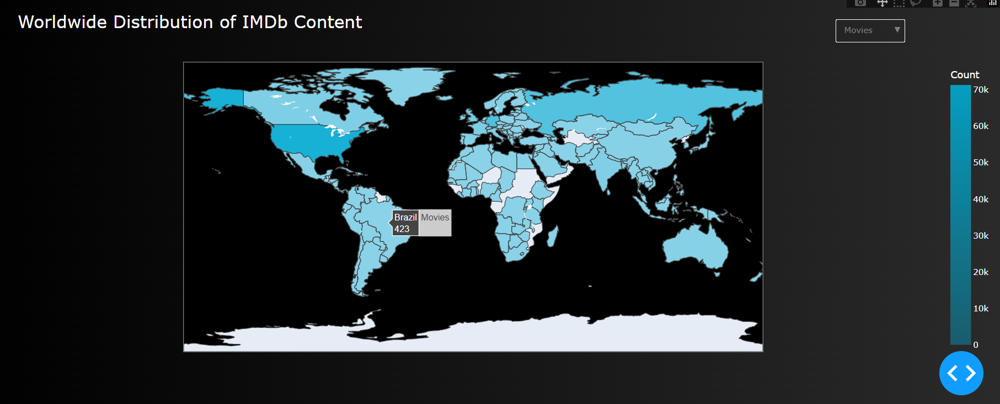

# Cine-Insights-Decoding-Cinema-s-insights-through-Visual-Analytics
"Cine Insights: Decoding Cinema's insights through Visual Analytics" is a detailed project developed as part of the Big Data Visual Analytics course (CS661). 

# About
 We explore a vast IMDb dataset containing movies and TV shows. Using advanced visual analytics techniques, we carefully study different aspects of these films, such as reviews, ratings, genres, and more. By analyzing directorial influences, actor dynamics, and other factors, we aim to uncover hidden patterns and emerging trends in the entertainment industry. Our goal is to provide valuable insights into how movies and TV shows are made and received. Join us on this exciting journey as we shed light on the secrets of the silver screen and push the boundaries of cinematic analysis.

 # Some screenshots of the Webapp
 Here are some screenshots of the interactive dashboard:

### Dashboard Overview

### Movies and TV series distribution

### Positive Reviews over the years

### Worldwide Distribution

 # How to run
 Clone the repository run the python notebook named WebApp.ipynb. You will be able to launch it in a local server written in the last cell in the python notebook. You will need to install libraries of Plotly, Dash and Wordcloud.
 
